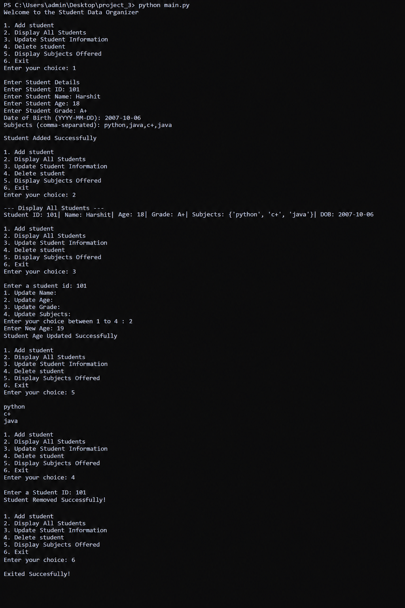

# Student Data Organizer

A simple Python-based **Student Data Organizer** that allows users to add, display, update, and delete student information. It also provides an option to display all subjects offered by the students.

## About the project

**Student Data organizer** is a simple python project used to manage student information

## 📌 Features

* Add student details
* Display all students
* Update student information

  * Update name
  * Update age
  * Update grade
  * Update subjects
* Delete a student using Student ID
* Display all subjects offered
* Exit the program
* Uses Python data structures such as:

  * Lists
  * Dictionaries
  * Tuples
  * Sets

## 🛠️ Technologies Used

* Python 3
* git
* github


## 📂 Project Structure

```text

│
├── main.py
├── output.png
└── README.md
```

## ▶️ How to Run

1. Make sure Python 3 is installed on your computer.
2. Open the project folder in a terminal or command prompt.
3. Run the following command:

```bash
python main.py
```

## 📋 Menu Options

When the program starts, the following menu is displayed:

```text
1. Add student
2. Display All Students
3. Update Student Information
4. Delete student
5. Display Subjects Offered
6. Exit
```

### 1. Add Student

Allows you to enter:

* Student ID
* Student Name
* Student Age
* Student Grade
* Date of Birth
* Subjects

Example:

```text
Enter Student ID: 101
Enter Student Name: Harshit
Enter Student Age: 18
Enter Student Grade: A
Date of Birth (YYYY-MM-DD): 2008-05-15
Subjects (comma-separated): Python,Math,English
```

### 2. Display All Students

Displays the stored information for all students, including:

* Student ID
* Name
* Age
* Grade
* Subjects
* Date of Birth

### 3. Update Student Information

You can update a student's:

1. Name
2. Age
3. Grade
4. Subjects

The student is identified using their Student ID.

### 4. Delete Student

Allows you to remove a student from the list by entering their Student ID.

### 5. Display Subjects Offered

Displays the subjects stored for the students. A **set** is used to avoid duplicate subjects.

### 6. Exit

Ends the program successfully.

## 🧠 Python Concepts Used

This project demonstrates several basic Python concepts:

* Variables
* User input
* `if`, `elif`, and `else`
* `while` loops
* `for` loops
* Lists
* Dictionaries
* Tuples
* Sets
* String operations
* Type conversion
* Adding and removing list elements

## 🎯 Purpose

The purpose of this project is to practice Python programming and learn how to organize and manage student data using different Python data structures.

## output



## 👨‍💻 Author

Harshit